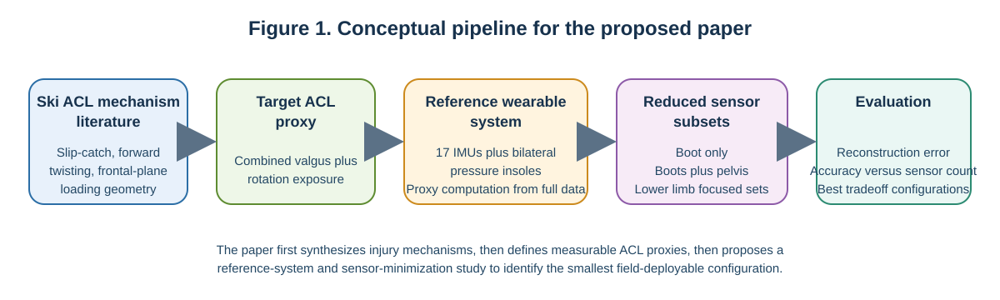
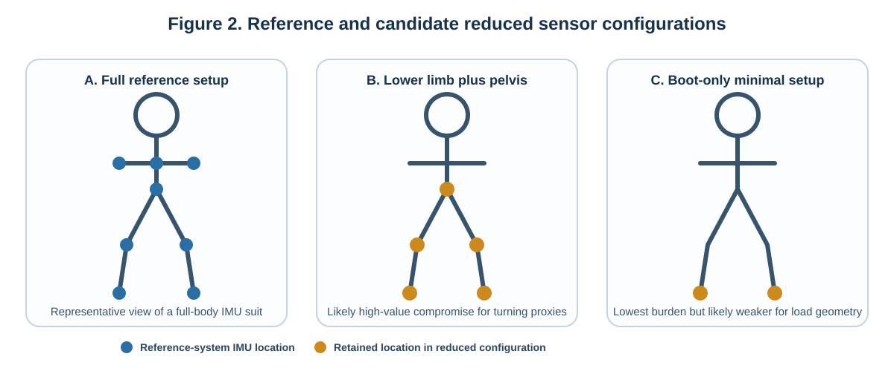

# Minimum Wearable Sensor Configuration for Estimating ACL Injury Proxies During Alpine Ski Turning

## Abstract

Anterior cruciate ligament injury is a major injury burden in alpine skiing, but field-based assessment of skiing-specific risk remains difficult. ACL mechanism studies identify turning-related loading patterns such as coupled valgus and tibia-femur rotation, while wearable skiing studies show that on-snow biomechanics can be captured with both full-body and sparse sensor systems. However, reduced-sensor studies have focused mainly on motion quality, turn detection, and performance rather than ACL-oriented monitoring. This paper reviews the skiing ACL and wearable-sensing literature and proposes a study to examine how proxy fidelity changes as sensor count is reduced. The study centers on one turning-related proxy, combined valgus-plus-rotation exposure, using a full-body inertial measurement unit suit and plantar pressure insoles as a reference system. Reduced sensor subsets would then be compared to characterize the tradeoff between biomechanical fidelity and sensing burden.

## Introduction

Anterior cruciate ligament injury is one of the most consequential injuries in alpine skiing because it is common, severe, and often associated with long rehabilitation and persistent joint morbidity. In both competitive and recreational skiing, the knee is among the most frequently injured body regions, and ACL rupture is a particularly important diagnosis because it can remove athletes from sport for extended periods and increase the risk of later instability, reinjury, and osteoarthritis. These consequences make ACL injury prevention an important biomechanics problem, not only for elite racers but also for the broader skiing population (Bere et al., 2011; Heinrich et al., 2023; Ruedl et al., 2011).

Alpine skiing also presents a distinctive injury-biomechanics problem compared with many field sports. The skier interacts with the snow through long skis, rigid boots, and bindings, which create loading pathways that can differ substantially from footwear-only sports. Video analyses of World Cup injuries have shown that turning-related ACL injury situations are often driven by ski-snow interaction and abrupt edge engagement rather than by the same movement patterns typically emphasized in court or field sports. In particular, slip-catch and related turning scenarios have been described as situations in which the outside knee is forced into a combination of valgus and tibial internal rotation. Recreational carving-ski studies further suggest that forward twisting falls are common outside elite racing contexts, reinforcing the broader point that skiing ACL injury risk should be understood through skiing-specific mechanisms rather than imported generic injury models (Bere et al., 2011; Bere et al., 2013; Ruedl et al., 2011).

This skiing-specific framing was established well before current IMU systems by Maury L. Hull and colleagues at UC Davis. Across a series of studies in the 1980s, Hull's group treated ski injury prevention as a measurement-and-modeling problem: first by deriving biomechanical models that linked boot-ski interface loads to injury-relevant tibial loading, then by building instrumented and microcomputer-controlled ski bindings that could record six load components during real skiing, and finally by combining those measurements with knee angle, axial loading, and muscle-activity data to characterize variables influencing knee loading on snow (Hull and Ramming, 1980; MacGregor et al., 1985a; Wunderly et al., 1988; Maxwell and Hull, 1989). That line of work is directly relevant here because it shows that alpine ski biomechanics has long aimed to estimate injury-relevant internal loading from externally measurable signals, even when direct in vivo injury measurement is impossible.

Because ACL rupture is a rare endpoint and cannot be studied experimentally in a direct way, skiing injury biomechanics depends on indirect evidence. Prior work has used systematic video analysis, model-based image matching, cadaveric or computational modeling, and instrumented on-snow measurements to infer which measurable variables lie on the pathway to injurious ACL loading. This literature supports the use of biomechanical proxies rather than direct injury prediction. Hull's ski-binding research is useful precedent here: it explicitly distinguished between externally measured boot-binding loads and the internal tissue loading or release criteria that those signals were intended to estimate (Hull and Ramming, 1980; MacGregor et al., 1985b; Maxwell and Hull, 1989). For the present paper, the most defensible turning-related proxy is combined valgus-plus-rotation exposure, motivated by repeated descriptions of injury situations in which knee valgus occurs together with tibia-femur rotation. Other skiing ACL variables, including force-line or external-moment measures, may also be important and in fact sit in the lineage of Hull's instrumented-binding work, but they are not as directly supported by the reduced wearable skiing literature available for this proposal. Landing-related variables are also intentionally excluded so that the paper stays centered on carving and turning rather than mixing multiple mechanisms with different sensing requirements (Bere et al., 2011; Bere et al., 2013).

Although these ACL-relevant proxies are grounded in injury-mechanism studies, measuring them in realistic skiing environments remains difficult. Historically, detailed biomechanical analysis in alpine skiing has often relied on expert or racing contexts and on instrumentation that is powerful but difficult to scale. A representative example is fusion motion capture in ski racing, where IMUs, GPS, pressure-sensitive insoles, video, and theodolite measurements were combined to analyze elite ski runs over an entire course. That work clearly demonstrated the value of multimodal field measurement, but it also reflected the complexity of systems built for high-performance racing analysis rather than broad deployment. Similar limitations appear in other expert-focused studies in which equipment, calibration, and post-processing demands are acceptable for research teams or elite programs but not for wider everyday use (Brodie et al., 2008).

Wearable sensing is an attractive alternative because it can operate on snow without camera occlusion, fixed capture volumes, or large infrastructure. Full-body inertial systems such as Xsens MVN have already shown that outdoor six-degree-of-freedom tracking of human motion is feasible with body-worn sensors and biomechanical modeling alone. Technically, the MVN framework does not rely on raw dead reckoning by itself. Instead, gyroscope- and accelerometer-based inertial navigation predictions are embedded in a prediction-correction loop, then mapped onto a subject-scaled biomechanical model after calibration using a known pose, functional movements, and anthropometric measurements. Drift is reduced by accelerometer-based gravity updates for inclination, magnetometer-based heading correction, Kalman-style joint updates that enforce statistical joint constraints, and detection of external contacts that constrain segment position and velocity. More importantly for skiing, wearable studies have demonstrated that joint kinematics and kinetics can be estimated during real ski turns. For example, one study of certified ski coaches used a 17-sensor Xsens setup together with plantar pressure insoles to estimate lower-extremity joint angles, forces, and moments during short and middle turns, confirming that a wearable reference system can capture the kinds of measurements needed for injury-oriented biomechanical analysis outside the laboratory (Roetenberg et al., 2009; Lee et al., 2017).

At the same time, a separate wearable-skiing literature has started to ask how much sensing is actually necessary. Reduced-sensor studies have shown that sparse IMU configurations can quantify turning behavior, detect ski turns, and generate motion-quality scores. In one example, two boot-mounted IMUs were sufficient to support motion-quality assessment across different skiing styles. More recent work has also shown that preprocessing methods can reduce sensitivity to sensor placement and orientation when the goal is to detect turns or represent side-to-side motion. These studies are important because they move skiing biomechanics toward portability and long-term field use. However, their primary targets are motion quality, activity recognition, or turn detection, not ACL-related proxy reconstruction (Snyder et al., 2021; Azadi et al., 2025).

This distinction defines the main gap in the current literature. Skiing ACL studies identify mechanism-consistent turning proxies, and wearable skiing studies show that on-snow sensing can be made smaller and more practical. What remains unclear is how these bodies of work connect: specifically, how much ACL-relevant information is lost as sensor count is reduced. That question matters scientifically because it links injury-mechanism knowledge to measurement design, and practically because fewer sensors could make injury-oriented monitoring more deployable beyond elite research settings. The proposed study therefore uses a full-body IMU-plus-insole system as a reference platform and evaluates how sensor reduction affects reconstruction of combined valgus-plus-rotation exposure during on-snow carving turns.

**Figure 1.** Conceptual pipeline for the proposed paper. The literature review first identifies skiing-specific ACL mechanisms, then narrows the target output to a measurable turning-related proxy, then motivates a reference wearable system and reduced sensor subsets that can be compared to identify the most promising tradeoffs between biomechanical fidelity and deployment burden.

## Proposed Research

The central question is how proxy fidelity changes as wearable sensor count is reduced during on-snow carving turns. Rather than attempting to predict ACL rupture directly, the proposed study focuses on one measurable turning-related proxy supported by both the skiing injury literature and the available wearable evidence: combined valgus-plus-rotation exposure. This variable was selected because it captures the coupled joint configuration repeatedly implicated in slip-catch and forward-twisting mechanisms and because it is more directly tied to wearable-derived kinematics than more ambitious force-line variables.

**Table 2.** Target ACL proxy for the proposed reduced-sensor study.

| Proxy | Mechanistic rationale | Reference-system estimate | Main challenge under sensor reduction | Primary evaluation target |
| --- | --- | --- | --- | --- |
| Combined valgus-plus-rotation exposure | Turning-related ski ACL mechanisms repeatedly involve knee valgus coupled with tibia-femur rotation, especially in slip-catch and forward-twisting scenarios. | Derived from reference-system knee kinematics during loaded turn phases; can be expressed as peak coupled state or time above a coupled threshold. | Sparse sensor sets may miss full lower-limb joint geometry, especially transverse-plane motion at the knee. | Compare how faithfully each reduced configuration tracks turn-level variation in the reference proxy across skier groups and snow conditions. |

The study would use a full-body reference system consisting of a 17-sensor inertial motion capture suit and bilateral plantar pressure insoles. This setup is not treated as direct measurement of injury risk, but as a high-information platform from which the target proxy can be estimated. In that sense, the study updates Hull's earlier instrumented-binding logic into a wearable context: instead of measuring six load components at the boot-ski interface and inferring injury-relevant loading from those signals, the proposed framework measures whole-body kinematics and plantar loading and infers a mechanism-consistent knee-state proxy from them (Hull and Ramming, 1980; Maxwell and Hull, 1989). Theoretically, accurate kinematic reconstruction would follow the MVN logic described by Roetenberg et al. (2009): first calibrate sensor-to-segment alignment with a neutral pose, functional movements, and subject anthropometrics; then estimate segment orientation and position with inertial navigation; then continuously correct drift by combining gravity and magnetic heading updates with biomechanical joint constraints. For skiing, the most useful additional correction is likely to come from ski-specific external-contact information. Bilateral plantar pressure insoles can identify loaded stance phases and outside-versus-inside ski loading, allowing the fusion algorithm to apply stronger contact constraints when a ski is strongly engaged with the snow. Unlike gait, these constraints should not assume zero foot velocity, because the skis glide; instead, they should constrain implausible vertical penetration, abrupt segment discontinuities, and anatomically unlikely joint motion while allowing forward translation along the ski path. Participants would perform standardized carving turns under broader field conditions than a narrow expert-racing protocol. The cohort should include beginners, intermediates, and advanced skiers, with a smaller expert subgroup if feasible, and data collection should span more than one snow condition so that the framework is tested under conditions closer to real-world skiing. A realistic first study would recruit roughly 24 to 30 skiers, each completing multiple runs with repeated analyzable turns (Lee et al., 2017; Snyder et al., 2021; Azadi et al., 2025).

After data collection, the reference system would be used to segment individual turns and compute the target proxy for each turn. Turn segmentation can follow activity-recognition pipelines already used in reduced-sensor skiing studies, where turns are identified from periodic IMU signals and enriched with turn-level metrics. Combined valgus-plus-rotation exposure can be quantified as a coupled knee state during loaded turning phases, for example as peak simultaneous valgus and transverse-plane rotation or as time spent above a coupled threshold. Because the target proxy depends mainly on local lower-extremity kinematics rather than exact global trajectory, the processing pipeline should prioritize accurate segment orientations, joint angles, and relative segment motion over absolute horizontal position. If global path reconstruction becomes important for turn-context features, GPS can be fused as an aiding sensor, but it does not need to be the primary source of proxy fidelity (Roetenberg et al., 2009).

The main experiment would then systematically reduce the available sensor information. Starting from the full reference setup, sensor subsets would be created by masking selected IMU segments while preserving the same recorded trials, isolating the effect of sensor reduction without recollecting data under different runs or slope conditions. Candidate configurations would include boot-only, boots plus pelvis, boots plus pelvis and trunk, a lower-limb set, and a lower-limb-plus-pelvis set. These span realistic tradeoffs between burden and information content. For each subset, a reconstruction model would estimate the ACL proxy using only the signals available to that subset.

**Figure 2.** Reference and candidate reduced sensor configurations for the proposed study. The full-body IMU plus insole system acts as the reference platform, while lower-limb-plus-pelvis and boot-only configurations illustrate the kinds of reduced setups that can be compared on proxy reconstruction fidelity and deployment burden.

The initial estimator should remain simple and interpretable. A physics-informed feature pipeline is a better starting point than a highly opaque end-to-end model. Reduced sensor signals would first be used to identify turn phases and derive segment-level motion features during steering and loading, and those features would then be mapped to the reference proxy estimates using baseline regression models. More flexible models could be explored later if needed, but they are not required to answer the core sensor-minimization question (Snyder et al., 2021; Azadi et al., 2025).

The primary analysis would compare each reduced configuration against the reference proxy estimate. Performance could be evaluated with turn-level error metrics such as RMSE, MAE, and correlation. The key result would be a fidelity-versus-sensor-count relationship rather than a single hard cutoff. In practice, the study would observe how much information is lost as sensing burden decreases and identify promising tradeoff points, ideally through a Pareto-frontier view of biomechanical fidelity versus sensor burden. Performance should also be compared across skier ability groups and snow conditions so that conclusions are not limited to a narrow expert-only, ideal-surface interpretation.

Although the main proposal focuses on sensor count, placement should be treated as a secondary design factor. Prior skiing studies show that placement and orientation can materially affect how well IMU signals represent turning motion. Once several promising reduced configurations are identified, their anatomical distribution can be compared qualitatively and, if feasible, through a limited placement sensitivity analysis.

Several difficulties can be anticipated. The target variable is not a direct injury label, so the study estimates a mechanism-consistent surrogate rather than true injury probability. In addition, field data collection is noisy, and reduced configurations may generalize unevenly across skier skill levels and snow conditions. These issues do not remove the value of the study, but they define the realistic scope of a first sensor-minimization framework for ACL-oriented skiing biomechanics.

If successful, this study would make two contributions. Scientifically, it would connect ski ACL injury-mechanism literature with wearable system design by identifying how well a mechanism-consistent turning proxy remains observable under sensor reduction. Practically, it would provide a rationale for more field-deployable injury-oriented monitoring systems that are less obtrusive than full-body research instrumentation. The likely outcome is not that a boot-only system will recover the proxy equally well, but that a lower-limb-centered configuration will preserve much of the useful information while substantially improving deployment practicality.

## Conclusion

Alpine skiing ACL injury research and skiing wearable-sensing research have advanced along related but only partially connected paths. Injury-mechanism studies have clarified that turning-related ACL loading in skiing is associated with specific coupled joint states, while wearable studies have shown that on-snow biomechanical measurement is feasible with both rich and reduced instrumentation. What remains unresolved is how far sensor reduction can proceed before ACL-relevant biomechanical information is lost. This paper argues that combined valgus-plus-rotation exposure provides a defensible starting point for this question because it is closely tied to skiing-specific turning mechanisms and is more directly estimable from wearable-derived kinematics than more ambitious force-line variables.

The proposed study addresses this gap by using a full-body IMU-plus-insole setup as a reference platform and systematically testing reduced sensor subsets during on-snow carving turns. Its novelty lies not in proposing another general skiing wearable, but in explicitly treating sensor minimization as an ACL-proxy reconstruction problem. If successful, the work would offer a more rigorous basis for designing field-deployable injury-oriented monitoring systems in alpine skiing. Future work could extend the framework to other skiing mechanisms, broader populations, and prospective intervention studies. A particularly useful follow-on would be a small validation study that pairs wearable-derived proxies with boot-ski interface load measurements in the spirit of Hull's instrumented-binding work, thereby reconnecting modern wearables to the earlier external-loading literature. Even without that extension, the present study would establish an important first step toward practical, mechanism-informed wearable assessment of ACL injury risk surrogates on snow.

## References

Azadi, B., Haslgruebler, M., Ferscha, A., 2025. Motion analysis in alpine skiing: sensor placement and orientation-invariant sensing. Sensors 25, 2582. https://doi.org/10.3390/s25082582

Bere, T., Florenes, T.W., Krosshaug, T., Koga, H., Nordsletten, L., Irving, C., Muller, E., Reid, R.C., Senner, V., Bahr, R., 2011. Mechanisms of anterior cruciate ligament injury in World Cup alpine skiing: a systematic video analysis of 20 cases. Am. J. Sports Med. 39, 1421-1429. https://doi.org/10.1177/0363546511405147

Bere, T., Mok, K.-M., Koga, H., Krosshaug, T., Nordsletten, L., Bahr, R., 2013. Kinematics of anterior cruciate ligament ruptures in World Cup alpine skiing: 2 case reports of the slip-catch mechanism. Am. J. Sports Med. 41, 1067-1073. https://doi.org/10.1177/0363546513479341

Brodie, M., Walmsley, A., Page, W., 2008. Fusion motion capture: a prototype system using inertial measurement units and GPS for the biomechanical analysis of ski racing. Sports Technol. 1, 17-28. https://doi.org/10.1002/jst.6

Hull, M.L., Ramming, J.E., 1980. A biomechanical model for actively controlled snow ski bindings. J. Biomech. Eng. 102, 326-331. https://doi.org/10.1115/1.3138230

Heinrich, D., van den Bogert, A.J., Moessner, M., Nachbauer, W., 2023. Model-based estimation of muscle and ACL forces during turning maneuvers in alpine skiing. Sci. Rep. 13, 9026. https://doi.org/10.1038/s41598-023-35775-4

Lee, S.K., Kim, K., Kim, Y.H., Lee, S.-S., 2017. Motion anlaysis in lower extremity joints during ski carving turns using wearble inertial sensors and plantar pressure sensors. In: 2017 IEEE International Conference on Systems, Man, and Cybernetics (SMC). IEEE, pp. 695-698. https://doi.org/10.1109/SMC.2017.8122688

MacGregor, D., Hull, M.L., Dorius, L.K., 1985a. A microcomputer controlled snow ski binding system. I. Instrumentation and field evaluation. J. Biomech. 18, 255-265. https://doi.org/10.1016/0021-9290(85)90843-7

MacGregor, D., Hull, M.L., 1985b. A microcomputer controlled snow ski binding system. II. Release decision theories. J. Biomech. 18, 267-275. https://doi.org/10.1016/0021-9290(85)90844-9

Maxwell, S.M., Hull, M.L., 1989. Measurement of strength and loading variables on the knee during alpine skiing. J. Biomech. 22, 609-624. https://doi.org/10.1016/0021-9290(89)90012-2

Roetenberg, D., Luinge, H., Slycke, P., 2009. Xsens MVN: full 6DOF human motion tracking using miniature inertial sensors. Xsens Motion Technologies BV, Enschede, The Netherlands.

Ruedl, G., Webhofer, M., Linortner, I., Schranz, A., Fink, C., Patterson, C., Nachbauer, W., Burtscher, M., 2011. ACL injury mechanisms and related factors in male and female carving skiers: a retrospective study. Int. J. Sports Med. 32, 801-806. https://doi.org/10.1055/s-0031-1279719

Snyder, C., Martinez, A., Jahnel, R., Roe, J., Stoeggl, T., 2021. Connected skiing: motion quality quantification in alpine skiing. Sensors 21, 3779. https://doi.org/10.3390/s21113779

Wunderly, G.S., Hull, M.L., Maxwell, S., 1988. A second generation microcomputer controlled binding system for alpine skiing research. J. Biomech. 21, 299-318. https://doi.org/10.1016/0021-9290(88)90260-6
